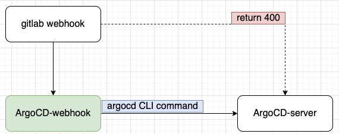

# ArgoCD webhook

官方ArgoCD对接gitlab webhook时，会出现返回400错误。
```shell
Webhook processing failed: X-Gitlab-Token validation failed
```
issue: https://github.com/argoproj/argo-cd/issues/15291

# diagram
于是曲线救国，开发个简单的webhook，对接gitlab的webhook，调用ArgoCD CLI去触发下面命令
```shell
argocd app sync <application>
```



# installation
## k8s (helm)
```shell
cd helm-chart
vi argocd-webhook/values.yaml
helm install argocd-webhook argocd-webhook
```